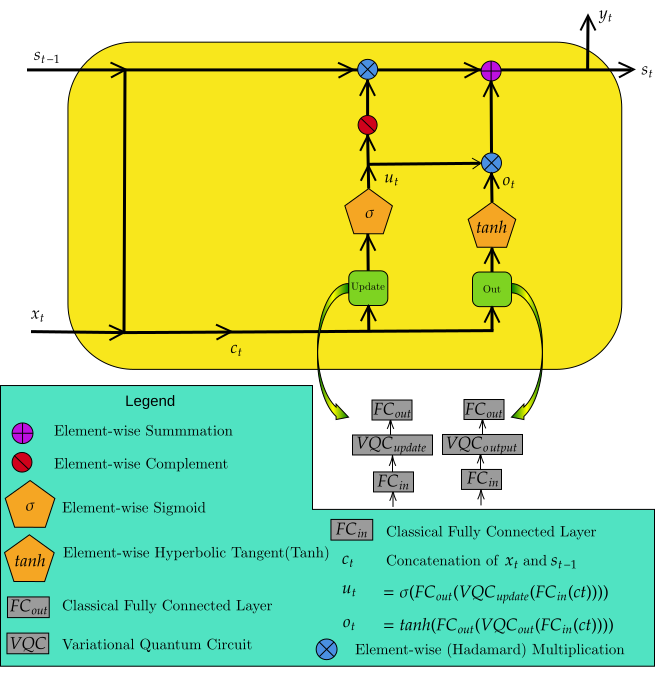
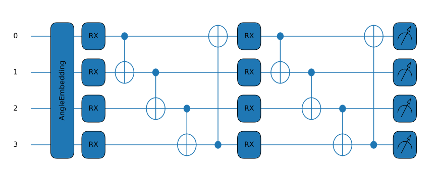

# QPRU-Quantum-Prototypical-Recurrent-Unit, QGRU, and QLSTM
Implementation of QPRU, paper A Quantum Variational approach to Prototypical Recurrent Unit.

This repository also includes the implementation of QLSTM (Quantum Long-Short Term Memory) and QGRU (Quantum Gated Recurrent Unit).

QPRU: Quantum Prototypical Recurrent Unit

  

  <b>Quantum implementations of QPRU, QGRU, and QLSTM using PennyLane</b>

⸻

Overview

This repository provides quantum implementations of three recurrent neural network architectures:

* QPRU — Quantum Prototypical Recurrent Unit
* QGRU — Quantum Gated Recurrent Unit
* QLSTM — Quantum Long Short-Term Memory

The implementations are developed using PennyLane and are intended to provide an accessible starting point for experimenting with quantum recurrent neural networks (QRNNs).

The main architecture introduced in this repository is the Quantum Prototypical Recurrent Unit (QPRU).

For the theoretical formulation, architecture, and experimental evaluation of QPRU, please refer to:

M. Sadeghi Garjan, T. Cesari, and M. Barbeau, “A Quantum Variational Approach to Prototypical Recurrent Unit,” 2026 IEEE International Conference on Quantum Communications, Networking, and Computing (QCNC), pp. 776–780, 2026.

📄 Paper: https://ieeexplore.ieee.org/document/11500435
 or https://arxiv.org/abs/2609.04354

⸻

Repository Contents

The Jupyter notebooks provide executable implementations and examples of:

* QPRU
* QGRU
* QLSTM
* Variational quantum circuits (VQCs)
* Time-series forecasting experiment (sin Function for simplicity in this case)

⸻

Quantum Prototypical Recurrent Unit (QPRU)

The QPRU is a lightweight quantum recurrent architecture designed to reduce the number of trainable quantum parameters while maintaining competitive forecasting performance.

The architecture is based on two quantum recurrent gates:

1. Update gate
2. Output gate

The QPRU receives the current input $x_t$ together with the previous hidden state $s_{t-1}$.

  

Architecture

The input to the recurrent mechanism is defined as

$$
c_t = [x_t, s_{t-1}],
$$

where $[,\cdot,\cdot,]$ denotes concatenation.

The concatenated vector is processed by classical fully connected layers before being provided to the variational quantum circuits.

The architecture contains:

* $x_t$: input at time step $t$
* $s_{t-1}$: previous hidden state
* $c_t$: concatenation of $x_t$ and $s_{t-1}$
* FC$_{in}$: fully connected layer used to map the classical representation to the dimensionality required by the VQC
* VQC: variational quantum circuit implementing the recurrent gate
* FC$_{out}$: fully connected layer mapping the quantum output back to the required classical dimensionality
* $s_t$: updated hidden state

Although the diagram shows separate FC${in}$ and FC${out}$ layers for the update and output gates, the same learned pair of fully connected layers can be shared by both gates. This parameter-sharing mechanism allows the two quantum gates to operate while reducing the number of additional classical parameters.

⸻

Variational Quantum Circuits

The recurrent gates in QPRU are implemented using variational quantum circuits.

  

The VQC consists of parameterized quantum operations and entangling operations. The circuit parameters are optimized jointly with the other trainable parameters of the recurrent model.

The quantum circuit receives a classical representation after the input projection and produces expectation values that are subsequently processed by the output projection.

A simplified workflow is:

Classical Input
      │
      ▼
  FC_in
      │
      ▼
 Quantum Encoding
      │
      ▼
     VQC
      │
      ▼
 Measurement
      │
      ▼
   FC_out
      │
      ▼
 Classical Recurrent Representation

⸻

QPRU, QGRU, and QLSTM

This repository provides implementations of three quantum recurrent architectures.

Model	Classical counterpart	Main idea
QPRU	PRU	Prototypical recurrent architecture implemented with VQCs
QGRU	GRU	Quantum implementation of gated recurrent units
QLSTM	LSTM	Quantum implementation of long short-term memory

The implementations allow the architectures to be studied under a common PennyLane-based framework.

⸻

Why QPRU?

A major motivation for QPRU is to explore whether recurrent architectures can be implemented using smaller and more parameter-efficient quantum circuits.

The QPRU paper investigates the relationship between model architecture, quantum circuit structure, and forecasting performance.

In the reported experiments, QPRU uses fewer quantum trainable parameters than the corresponding QLSTM and QGRU implementations while achieving competitive forecasting performance. For the complete experimental setup, parameter counts, and results, please refer to the paper.

📄 Read the paper:
https://arxiv.org/abs/2609.04354

⸻

Installation

Clone the repository:

git clone https://github.com/mahyarsadeghi/QPRU-Quantum-Prototypical-Recurrent-Unit.git
cd QPRU-Quantum-Prototypical-Recurrent-Unit

Install the required Python packages:

pip install pennylane
pip install numpy
pip install pandas
pip install matplotlib

Additional dependencies may be required depending on the notebook being executed.

⸻

Usage

The implementations are provided through Jupyter notebooks.

Start Jupyter:

jupyter notebook

Then open the corresponding notebook and run the cells sequentially.

The notebooks can be used to:

1. Construct the quantum recurrent architectures.
2. Configure the number of qubits and circuit layers.
3. Encode classical inputs into quantum states.
4. Execute the variational quantum circuits.
5. Obtain quantum measurements.
6. Train the recurrent model.
7. Evaluate the model on forecasting tasks.

⸻

Citation

If you use the QPRU architecture, implementation, or ideas from this repository in your research, please cite the following paper:

BibTeX

@inproceedings{sadeghi2026qpru,
  author    = {Mahyar Sadeghi Garjan and Tommaso Cesari and Michel Barbeau},
  title     = {A Quantum Variational Approach to Prototypical Recurrent Unit},
  booktitle = {2026 IEEE International Conference on Quantum Communications, Networking, and Computing (QCNC)},
  pages     = {776--780},
  year      = {2026},
  doi       = {10.1109/QCNC69040.2026.00126}
}

Paper:

Sadeghi Garjan, M., Cesari, T., & Barbeau, M. (2026).
A Quantum Variational Approach to Prototypical Recurrent Unit.
2026 IEEE International Conference on Quantum Communications, Networking, and Computing (QCNC), 776–780.

arXiv:2609.04354

⸻

Related Resources

* 📄 Research paper: A Quantum Variational Approach to Prototypical Recurrent Unit
* 💻 GitHub repository: QPRU — Quantum Prototypical Recurrent Unit
* ⚛️ PennyLane: https://pennylane.ai/

⸻

Authors

Mahyar Sadeghi Garjan
University of Ottawa

Tommaso Cesari
University of Ottawa

Michel Barbeau
University of Ottawa

⸻

License

Please see the repository license for terms of use.
